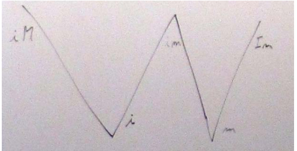
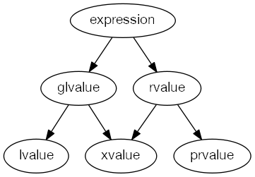
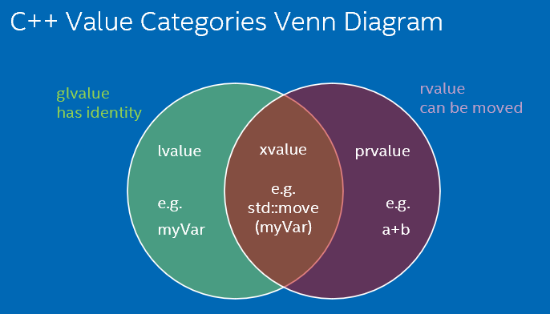
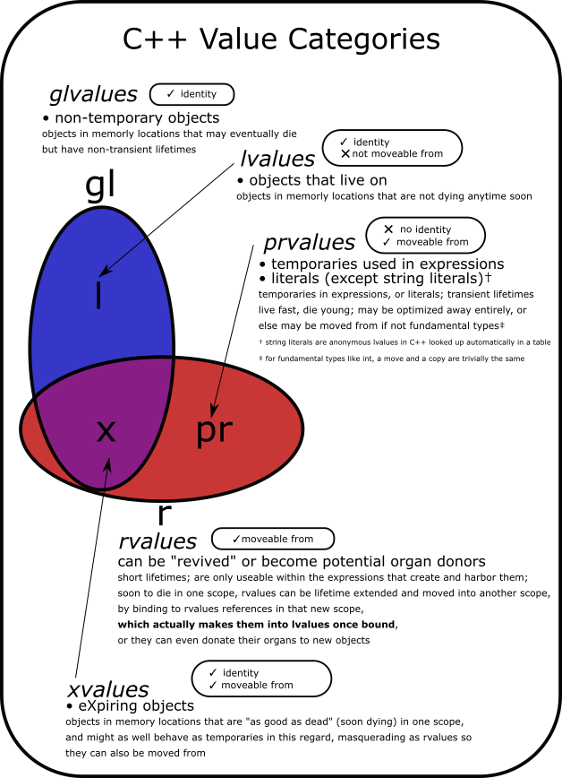

> In C++03, an expression is either an rvalue or an lvalue.
>
> In C++11, an expression can be an:
>
> - rvalue
> - lvalue
> - xvalue
> - glvalue
>
> - prvalue
>
> Two categories have become five categories.
>
> - What are these new categories of expressions?
> - How do these new categories relate to the existing rvalue and lvalue categories?
> - Are the rvalue and lvalue categories in C++0x the same as they are in C++03?
> - Why are these new categories needed? Are the [WG21](http://www.open-std.org/jtc1/sc22/wg21/) gods just trying to confuse us mere mortals?
>
> https://stackoverflow.com/questions/3601602/what-are-rvalues-lvalues-xvalues-glvalues-and-prvalues


I guess this document might serve as a not so short introduction : [n3055](http://www.open-std.org/jtc1/sc22/wg21/docs/papers/2010/n3055.pdf)

The whole massacre began with the move semantics. Once we have expressions that can be moved and not copied, suddenly easy to grasp rules demanded distinction between expressions that can be moved, and in which direction.

From what I guess based on the draft, the r/l value distinction stays the same, only in the context of moving things get messy.

Are they needed? Probably not if we wish to forfeit the new features. But to allow better optimization we should probably embrace them.

**Quoting [n3055](http://www.open-std.org/jtc1/sc22/wg21/docs/papers/2010/n3055.pdf):**

- An **lvalue** (so-called, historically, because lvalues could appear on the left-hand side of an assignment expression) designates a function or an object. *[Example: If `E` is an expression of pointer type, then `\*E` is an lvalue expression referring to the object or function to which `E` points. As another example, the result of calling a function whose return type is an lvalue reference is an lvalue.]*
- An **xvalue** (an “eXpiring” value) also refers to an object, usually near the end of its lifetime (so that its resources may be moved, for example). An xvalue is the result of certain kinds of expressions involving rvalue references. *[Example: The result of calling a function whose return type is an rvalue reference is an xvalue.]*
- A **glvalue** (“generalized” lvalue) is an **lvalue** or an **xvalue**.
- An **rvalue** (so-called, historically, because rvalues could appear on the right-hand side of an assignment expression) is an xvalue, a temporary object or subobject thereof, or a value that is not associated with an object.
- A **prvalue** (“pure” rvalue) is an rvalue that is not an xvalue. *[Example: The result of calling a function whose return type is not a reference is a prvalue]*

The document in question is a great reference for this question, because it shows the exact changes in the standard that have happened as a result of the introduction of the new nomenclature.

---

> What are these new categories of expressions?

The [FCD (n3092)](http://www.open-std.org/JTC1/SC22/WG21/docs/papers/2010/n3092.pdf) has an excellent description:

> — An lvalue (so called, historically, because lvalues could appear on the left-hand side of an assignment expression) designates a function or an object. [ Example: If E is an expression of pointer type, then *E is an lvalue expression referring to the object or function to which E points. As another example, the result of calling a function whose return type is an lvalue reference is an lvalue. —end example ]
>
> — An xvalue (an “eXpiring” value) also refers to an object, usually near the end of its lifetime (so that its resources may be moved, for example). An xvalue is the result of certain kinds of expressions involving rvalue references (8.3.2). [ Example: The result of calling a function whose return type is an rvalue reference is an xvalue. —end example ]
>
> — A glvalue (“generalized” lvalue) is an lvalue or an xvalue.
>
> — An rvalue (so called, historically, because rvalues could appear on the right-hand side of an assignment expressions) is an xvalue, a temporary object (12.2) or subobject thereof, or a value that is not associated with an object.
>
> — A prvalue (“pure” rvalue) is an rvalue that is not an xvalue. [ Example: The result of calling a function whose return type is not a reference is a prvalue. The value of a literal such as 12, 7.3e5, or true is also a prvalue. —end example ]
>
> Every expression belongs to exactly one of the fundamental classifications in this taxonomy: lvalue, xvalue, or prvalue. This property of an expression is called its value category. [ Note: The discussion of each built-in operator in Clause 5 indicates the category of the value it yields and the value categories of the operands it expects. For example, the built-in assignment operators expect that the left operand is an lvalue and that the right operand is a prvalue and yield an lvalue as the result. User-defined operators are functions, and the categories of values they expect and yield are determined by their parameter and return types. —end note

I suggest you read the entire section **3.10 Lvalues and rvalues** though.

> How do these new categories relate to the existing rvalue and lvalue categories?

Again:


> Are the rvalue and lvalue categories in C++0x the same as they are in C++03?

The semantics of rvalues has evolved particularly with the introduction of move semantics.

> Why are these new categories needed?

So that move construction/assignment could be defined and supported.

---

I'll start with your last question:

> Why are these new categories needed?

The C++ standard contains many rules that deal with the value category of an expression. Some rules make a distinction between lvalue and rvalue. For example, when it comes to overload resolution. Other rules make a distinction between glvalue and prvalue. For example, you can have a glvalue with an incomplete or abstract type but there is no prvalue with an incomplete or abstract type. Before we had this terminology the rules that actually need to distinguish between glvalue/prvalue referred to lvalue/rvalue and they were either unintentionally wrong or contained lots of explaining and exceptions to the rule a la "...unless the rvalue is due to unnamed rvalue reference...". So, it seems like a good idea to just give the concepts of glvalues and prvalues their own name.

> What are these new categories of expressions? How do these new categories relate to the existing rvalue and lvalue categories?

We still have the terms lvalue and rvalue that are compatible with C++98. We just divided the rvalues into two subgroups, xvalues and prvalues, and we refer to lvalues and xvalues as glvalues. Xvalues are a new kind of value category for unnamed rvalue references. Every expression is one of these three: lvalue, xvalue, prvalue. A Venn diagram would look like this:

```cpp
    ______ ______
   /      X      \
  /      / \      \
 |   l  | x |  pr  |
  \      \ /      /
   \______X______/
       gl    r
```

Examples with functions:

```cpp
int   prvalue();
int&  lvalue();
int&& xvalue();
```

But also don't forget that named rvalue references are lvalues:

```cpp
void foo(int&& t) {
  // t is initialized with an rvalue expression
  // but is actually an lvalue expression itself
}
```

---

IMHO, the best explanation about its meaning gave us [Stroustrup](http://www.stroustrup.com/terminology.pdf) + take into account examples of [Dániel Sándor](https://stackoverflow.com/a/34901787/1433373) and [Mohan](https://stackoverflow.com/a/38559710/1433373):

**Stroustrup:**

> Now I was seriously worried. Clearly we were headed for an impasse or a mess or both. I spent the lunchtime doing an analysis to see which of the properties (of values) were independent. There were only two independent properties:
>
> - `has identity` – i.e. and address, a pointer, the user can determine whether two copies are identical, etc.
> - `can be moved from` – i.e. we are allowed to leave to source of a "copy" in some indeterminate, but valid state
>
> This led me to the conclusion that there are exactly three kinds of values (using the regex notational trick of using a capital letter to indicate a negative – I was in a hurry):
>
> - `iM`: has identity and cannot be moved from
>
> - `im`: has identity and can be moved from (e.g. the result of casting an lvalue to a rvalue reference)
>
> - `Im`: does not have identity and can be moved from.
>
>   The fourth possibility, `IM`, (doesn’t have identity and cannot be moved) is not useful in `C++` (or, I think) in any other language.
>
> In addition to these three fundamental classifications of values, we have two obvious generalizations that correspond to the two independent properties:
>
> - `i`: has identity
> - `m`: can be moved from
>
> This led me to put this diagram on the board: [](https://i.stack.imgur.com/yY4zK.png)
>
> ## Naming
>
> I observed that we had only limited freedom to name: The two points to the left (labeled `iM` and `i`) are what people with more or less formality have called `lvalues` and the two points on the right (labeled `m` and `Im`) are what people with more or less formality have called `rvalues`. This must be reflected in our naming. That is, the left "leg" of the `W` should have names related to `lvalue` and the right "leg" of the `W` should have names related to `rvalue.` I note that this whole discussion/problem arise from the introduction of rvalue references and move semantics. These notions simply don’t exist in Strachey’s world consisting of just `rvalues` and `lvalues`. Someone observed that the ideas that
>
> - Every `value` is either an `lvalue` or an `rvalue`
> - An `lvalue` is not an `rvalue` and an `rvalue` is not an `lvalue`
>
> are deeply embedded in our consciousness, very useful properties, and traces of this dichotomy can be found all over the draft standard. We all agreed that we ought to preserve those properties (and make them precise). This further constrained our naming choices. I observed that the standard library wording uses `rvalue` to mean `m` (the generalization), so that to preserve the expectation and text of the standard library the right-hand bottom point of the `W` should be named `rvalue.`
>
> This led to a focused discussion of naming. First, we needed to decide on `lvalue.` Should `lvalue` mean `iM` or the generalization `i`? Led by Doug Gregor, we listed the places in the core language wording where the word `lvalue` was qualified to mean the one or the other. A list was made and in most cases and in the most tricky/brittle text `lvalue` currently means `iM`. This is the classical meaning of lvalue because "in the old days" nothing was moved; `move` is a novel notion in `C++0x`. Also, naming the topleft point of the `W` `lvalue` gives us the property that every value is an `lvalue` or an `rvalue`, but not both.
>
> So, the top left point of the `W` is `lvalue` and the bottom right point is `rvalue.` What does that make the bottom left and top right points? The bottom left point is a generalization of the classical lvalue, allowing for move. So it is a `generalized lvalue.` We named it `glvalue.` You can quibble about the abbreviation, but (I think) not with the logic. We assumed that in serious use `generalized lvalue` would somehow be abbreviated anyway, so we had better do it immediately (or risk confusion). The top right point of the W is less general than the bottom right (now, as ever, called `rvalue`). That point represent the original pure notion of an object you can move from because it cannot be referred to again (except by a destructor). I liked the phrase `specialized rvalue` in contrast to `generalized  lvalue` but `pure rvalue` abbreviated to `prvalue` won out (and probably rightly so). So, the left leg of the W is `lvalue` and `glvalue` and the right leg is `prvalue` and `rvalue.` Incidentally, every value is either a glvalue or a prvalue, but not both.
>
> This leaves the top middle of the `W`: `im`; that is, values that have identity and can be moved. We really don’t have anything that guides us to a good name for those esoteric beasts. They are important to people working with the (draft) standard text, but are unlikely to become a household name. We didn’t find any real constraints on the naming to guide us, so we picked ‘x’ for the center, the unknown, the strange, the xpert only, or even x-rated.
>
> [](https://i.stack.imgur.com/zxsYZ.png)

---

## **INTRODUCTION**

ISOC++11 (officially ISO/IEC 14882:2011) is the most recent version of the standard of the C++ programming language. It contains some new features, and concepts, for example:

- rvalue references
- xvalue, glvalue, prvalue expression value categories
- move semantics

If we would like to understand the concepts of the new expression value categories we have to be aware of that there are rvalue and lvalue references. It is better to know rvalues can be passed to non-const rvalue references.

```cpp
int& r_i=7; // compile error
int&& rr_i=7; // OK
```

We can gain some intuition of the concepts of value categories if we quote the subsection titled Lvalues and rvalues from the working draft N3337 (the most similar draft to the published ISOC++11 standard).

> **3.10 Lvalues and rvalues [basic.lval]**
>
> 1 Expressions are categorized according to the taxonomy in Figure 1.
>
> - An lvalue (so called, historically, because lvalues could appear on the left-hand side of an assignment expression) designates a function or an object. [ Example: If E is an expression of pointer type, then *E is an lvalue expression referring to the object or function to which E points. As another example, the result of calling a function whose return type is an lvalue reference is an lvalue. —end example ]
> - An xvalue (an “eXpiring” value) also refers to an object, usually near the end of its lifetime (so that its resources may be moved, for example). An xvalue is the result of certain kinds of expressions involving rvalue references (8.3.2). [ Example: The result of calling a function whose return type is an rvalue reference is an xvalue. —end example ]
> - A glvalue (“generalized” lvalue) is an lvalue or an xvalue.
> - An rvalue (so called, historically, because rvalues could appear on the right-hand side of an assignment expression) is an xvalue, a
>   temporary object (12.2) or subobject thereof, or a value that is not
>   associated with an object.
> - A prvalue (“pure” rvalue) is an rvalue that is not an xvalue. [ Example: The result of calling a function whose return type is not a
>   reference is a prvalue. The value of a literal such as 12, 7.3e5, or
>   true is also a prvalue. —end example ]
>
> Every expression belongs to exactly one of the fundamental classifications in this taxonomy: lvalue, xvalue, or prvalue. This property of an expression is called its value category.

But I am not quite sure about that this subsection is enough to understand the concepts clearly, because "usually" is not really general, "near the end of its lifetime" is not really concrete, "involving rvalue references" is not really clear, and "Example: The result of calling a function whose return type is an rvalue reference is an xvalue." sounds like a snake is biting its tail.

## **PRIMARY VALUE CATEGORIES**

Every expression belongs to exactly one primary value category. These value categories are lvalue, xvalue and prvalue categories.

## **lvalues**

*The expression E belongs to the lvalue category if and only if E refers to an entity that ALREADY has had an identity (address, name or alias) that makes it accessible outside of E.*

```cpp
#include <iostream>

int i=7;

const int& f(){
    return i;
}

int main()
{
    std::cout<<&"www"<<std::endl; // The expression "www" in this row is an lvalue expression, because string literals are arrays and every array has an address.  

    i; // The expression i in this row is an lvalue expression, because it refers to the same entity ...
    i; // ... as the entity the expression i in this row refers to.

    int* p_i=new int(7);
    *p_i; // The expression *p_i in this row is an lvalue expression, because it refers to the same entity ...
    *p_i; // ... as the entity the expression *p_i in this row refers to.

    const int& r_I=7;
    r_I; // The expression r_I in this row is an lvalue expression, because it refers to the same entity ...
    r_I; // ... as the entity the expression r_I in this row refers to.

    f(); // The expression f() in this row is an lvalue expression, because it refers to the same entity ...
    i; // ... as the entity the expression f() in this row refers to.

    return 0;
}
```

## **xvalues**

*The expression E belongs to the xvalue category if and only if it is*

*— the result of calling a function, whether implicitly or explicitly, whose return type is an rvalue reference to the type of object being returned, or*

```cpp
int&& f(){
    return 3;
}

int main()
{
    f(); // The expression f() belongs to the xvalue category, because f() return type is an rvalue reference to object type.

    return 0;
}
```

*— a cast to an rvalue reference to object type, or*

```cpp
int main()
{
    static_cast<int&&>(7); // The expression static_cast<int&&>(7) belongs to the xvalue category, because it is a cast to an rvalue reference to object type.
    std::move(7); // std::move(7) is equivalent to static_cast<int&&>(7).

    return 0;
}
```

*— a class member access expression designating a non-static data member of non-reference type in which the object expression is an xvalue, or*

```cpp
struct As
{
    int i;
};

As&& f(){
    return As();
}

int main()
{
    f().i; // The expression f().i belongs to the xvalue category, because As::i is a non-static data member of non-reference type, and the subexpression f() belongs to the xvlaue category.

    return 0;
}
```

*— a pointer-to-member expression in which the first operand is an xvalue and the second operand is a pointer to data member.*

Note that the effect of the rules above is that named rvalue references to objects are treated as lvalues and unnamed rvalue references to objects are treated as xvalues; rvalue references to functions are treated as lvalues whether named or not.

```cpp
#include <functional>

struct As
{
    int i;
};

As&& f(){
    return As();
}

int main()
{
    f(); // The expression f() belongs to the xvalue category, because it refers to an unnamed rvalue reference to object.
    As&& rr_a=As();
    rr_a; // The expression rr_a belongs to the lvalue category, because it refers to a named rvalue reference to object.
    std::ref(f); // The expression std::ref(f) belongs to the lvalue category, because it refers to an rvalue reference to function.

    return 0;
}
```

## **prvalues**

*The expression E belongs to the prvalue category if and only if E belongs neither to the lvalue nor to the xvalue category.*

```cpp
struct As
{
    void f(){
        this; // The expression this is a prvalue expression. Note, that the expression this is not a variable.
    }
};

As f(){
    return As();
}

int main()
{
    f(); // The expression f() belongs to the prvalue category, because it belongs neither to the lvalue nor to the xvalue category.

    return 0;
}
```

## **MIXED VALUE CATEGORIES**

There are two further important mixed value categories. These value categories are rvalue and glvalue categories.

## **rvalues**

*The expression E belongs to the rvalue category if and only if E belongs to the xvalue category, or to the prvalue category.*

Note that this definition means that the expression E belongs to the rvalue category if and only if E refers to an entity that has not had any identity that makes it accessible outside of E YET.

## **glvalues**

*The expression E belongs to the glvalue category if and only if E belongs to the lvalue category, or to the xvalue category.*

## **A PRACTICAL RULE**

Scott Meyer has [published](https://isocpp.org/blog/2012/11/universal-references-in-c11-scott-meyers) a very useful rule of thumb to distinguish rvalues from lvalues.

> - If you can take the address of an expression, the expression is an lvalue.
> - If the type of an expression is an lvalue reference (e.g., T& or const T&, etc.), that expression is an lvalue.
> - Otherwise, the expression is an rvalue. Conceptually (and typically also in fact), rvalues correspond to temporary objects, such as those returned from functions or created through implicit type conversions. Most literal values (e.g., 10 and 5.3) are also rvalues.

---

I have struggled with this for a long time, until I came across the cppreference.com explanation of the [value categories](http://en.cppreference.com/w/cpp/language/value_category).

It is actually rather simple, but I find that it is often explained in a way that's hard to memorize. Here it is explained very schematically. I'll quote some parts of the page:

> ### Primary categories
>
> The primary value categories correspond to two properties of expressions:
>
> - *has identity*: it's possible to determine whether the expression refers to the same entity as another expression, such as by comparing addresses of the objects or the functions they identify (obtained directly or indirectly);
> - *can be moved from*: move constructor, move assignment operator, or another function overload that implements move semantics can bind to the expression.
>
> Expressions that:
>
> - have identity and cannot be moved from are called *lvalue expressions*;
> - have identity and can be moved from are called *xvalue expressions*;
> - do not have identity and can be moved from are called *prvalue expressions*;
> - do not have identity and cannot be moved from are not used.
>
> ### lvalue
>
> An lvalue ("left value") expression is an expression that *has identity* and *cannot be moved from*.
>
> ### rvalue (until C++11), prvalue (since C++11)
>
> A prvalue ("pure rvalue") expression is an expression that *does not have identity* and *can be moved from*.
>
> ### xvalue
>
> An xvalue ("expiring value") expression is an expression that *has identity* and *can be moved from*.
>
> ### glvalue
>
> A glvalue ("generalized lvalue") expression is an expression that is either an lvalue or an xvalue. It *has identity*. It may or may not be moved from.
>
> ### rvalue (since C++11)
>
> An rvalue ("right value") expression is an expression that is either a prvalue or an xvalue. It *can be moved from*. It may or may not have identity.

## So let's put that into a table:

|                              | Can be moved from (= rvalue) | Cannot be moved from |
| :--------------------------- | :--------------------------- | :------------------- |
| **Has identity (= glvalue)** | xvalue                       | lvalue               |
| **No identity**              | prvalue                      | not used             |

---

These are terms that the C++ committee used to define move semantics in C++11. [Here's the story](https://www.stroustrup.com/terminology.pdf).

I find it difficult to understand the terms given their precise definitions, the [long lists of rules](https://en.cppreference.com/w/cpp/language/value_category) or this popular diagram:



It's easier on a Venn diagram with typical examples:



Basically:

- every expression is either lvalue or rvalue
- lvalue must be copied, because it has identity, so can be used later
- rvalue can be moved, either because it's a temporary (prvalue) or explicitly moved (xvalue)

Now, the good question is that if we have two orthogonal properties ("has identity" and "can be moved"), what's the fourth category to complete lvalue, xvalue and prvalue? That would be an expression that has no identity (hence cannot be accessed later) and cannot be moved (one need to copy its value). This is simply not useful, so hasn't been named.

---

This is Venn diagram I made for a highly visual C++ book I'm writing which I will be publishing on leanpub during development soon.

[](https://i.stack.imgur.com/e6xMb.png)

The other answers go into more detail with words, and show similar diagrams. But hopefully this presentation of the information is fairly complete and useful for referencing, in addition.

The main takeaway for me on this topic is that expressions have these two properties: *identity* and *movability*. The first deals with the the "solidness" with which something exists. That's important because the C++ abstract machine is allowed to and encouraged to aggressively change and shrink your code through optimizations, and that means that things without identity might only ever exist in the mind of the compiler or in a register for a brief moment before getting trampled on. But a piece of data like that is also guaranteed not to cause issues if you recycle it's innards since there's no way to try to use it. And thus, move semantics were invented to allow us to capture references to temporaries, upgrading them to lvalues and extending their lifetime.

Move semantics originally were about not just throwing away temporaries wastefully, but instead giving them away so they can consumed by another.

[](https://i.stack.imgur.com/aDlzx.png)

When you give your cornbread away, the person you give it to now owns it. They consume it. You should not attempt to eat or digest said cornbread once you've given it away. Maybe that cornbread was headed for the trash anyway, but now it's headed for their bellies. It's not yours anymore.

In C++ land, the idea of "consuming" a resource means that resource is now owned by us and so we should do any cleanup necessary, and ensure the object isn't accessed elsewhere. Often times, that means borrowing the guts to create new objects. I call that "donating organs". Usually, we are talking about pointers or references contained by the object, or something like that, and we want to keep those pointers or references around because they refer to data elsewhere in our program that is not dying.

Thus you could write a function overload that takes an rvalue reference, and if a temporary (prvalue) were passed in, that's the overload that would be called. A new lvalue would be created upon binding to the rvalue reference taken by the function, extending the life of the temporary so you could consume it within your function.

At some point, we realized that we often had lvalue non-temporary data that we were finished with in one scope, but wanted to cannibalize in another scope. But they aren't rvalues and so wouldn't bind to an rvalue reference. So we made `std::move`, which is just a fancy cast from lvalue to rvalue reference. Such a datum is an xvalue: a former lvalue now acting as if it were a temporary so it can also be moved from.

---

