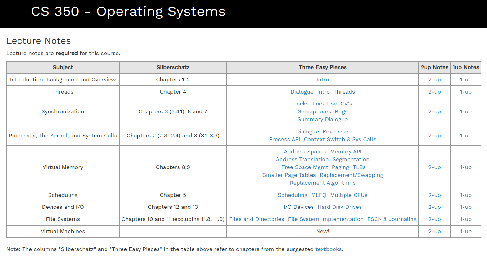

- Operating Systems:Three Easy Pieces:
  - https://pages.cs.wisc.edu/~remzi/OSTEP/Chinese/toc.pdf
- cs350: 
  - https://student.cs.uwaterloo.ca/~cs350/F21/notes/
  - https://student.cs.uwaterloo.ca/~cs350/F21/reading.shtml
    - 
  - https://student.cs.uwaterloo.ca/~cs350/common/Larus-Mips.pdf
  - 虚拟地址转换 https://student.cs.uwaterloo.ca/~cs350/common/Paging-Flowchart.pdf